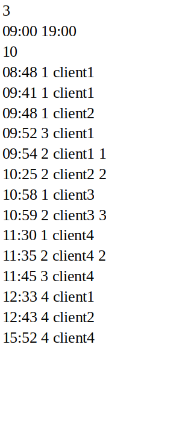
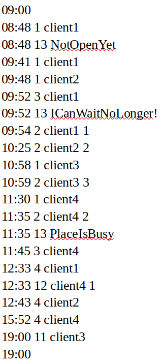

# comp_club

## Description
These programm is prototype of a system that monitors the work of the computer club, processes events and calculates the revenue for the day and the time of activity of each table.

## Input data
All the input data one should be written in some text file and then transfer it as a second command line argument after the name of executable (will be shown below).

* The first line contains the number of tables as a positive integer.
* The second line specifies the start and end time of the computer club, separated by a space.
* The third line specifies the cost per hour in the computer club as a positive integer.
* Then a list of incoming events is set, separated by a line break. Inside the string, a single space is used as a separator between the elements. 

_Incoming events_:
1. _Client enter_
2. _Client take the table_
3. _Client is waiting_
4. _Client quit_

The example of input data:



## Output data

If the input data is uncorrect, the program should output the first line with a mistake and shut down. Else should output the following result:
* The first line shows the start time.
* The following lists all the events that occurred during the working day (incoming and outgoing), each on a separate line.
* After the list of events, the end time is printed on a separate line.
* For each table, the following parameters are separated by a space on a separate line: table number, revenue for the day and the time it was active during the working day.

_Outgoing events (generating during execution):_

11. _Client quit_
22. _Client take the table_
33. _Error_

The output for input data from example:




## Structure
Project contains 2 parts:
* _comp_club_
* _input_check_

__include__ folder contains __*.h__ files of these parts, __src__ contains __*.cpp__ ones and __main.cpp__. _input_check_ is responsible for correctness data, if input data is correct, _comp_club_ starts it's work. The __test_files__ folder contains 10 examples of input data text files. 
## Build
You can compile this programm with g++:
```
g++ -std=c++20 -Wall -Wextra -Wpedantic ./src/comp_club.cpp ./src/input_check.cpp ./src/main.cpp -o run
```
or build with CMake (target object file is called __run__):
```
mkdir build
cd build
cmake ..
make
```
## Run
As mentioned earlier, you should transfer a file with input_data as a second command line argument, like this:
```
./run ./test_files/tst_file.txt
```

